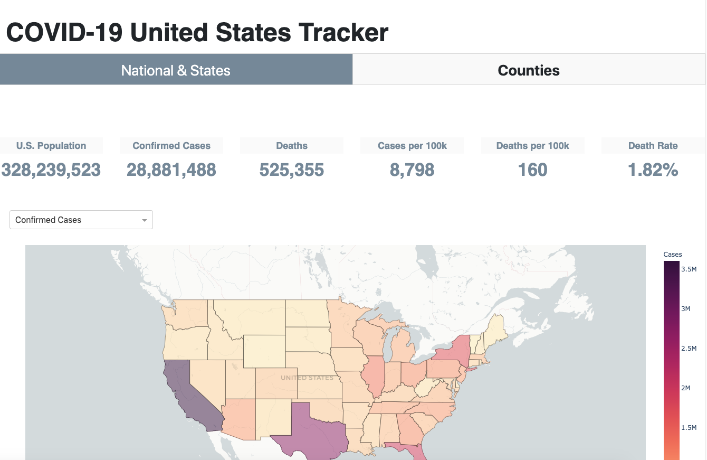
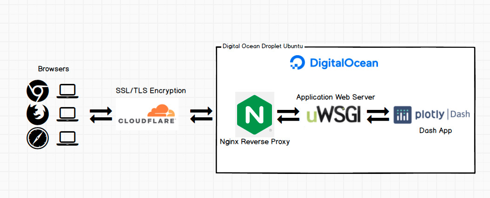

# COVID-19 United States Tracker

> Aggregating and monitoring COVID-19 metrics at the national, state and county level.

---

## Description

- The Plotly Dash application tracks key metrics related to COVID-19 cases in the United States. 
- Metrics are displayed through mapbox heatmaps, time series, and aggregated values.
- Metrics cover states and counties in the United States.
- COVID-19 Dash web application >> [https://cv19trackerus.com](https://cv19trackerus.com)

## Environment Files

- conda: `environment.yml`
- venv: `requirements.txt`

## Scripts to MongoDB

- `stats_csv_to_mongo.py` (Need to run just once)
- `covid_csv_to_mongo.py` (Scheduled to run daily as a cron job)

## Application Setup

| File Name | Description |
| ---- | ----------- |
| app.py | Initiates the Dash application. |
| /apps/app_counties.py | Generates county-level layout with Dash callback functions.|
| /apps/app_states.py | Generates state-level layout with Dash callback functions. |
| index.py | Generates main layout to handle multi-page Dash application. |
| wsgi.py | Separate file with application variable created to interact with uWSGI web server in DO droplet. |

## Key Metrics

- Confirmed Cases
- Deaths 
- Cases per 100k and Cases per 1000
- Deaths per 100k
- Death Rate (Deaths/Confirmed Cases per specified area)
- Population by county, state, and USA

## Tech Stack

- Python-3.7.7
- Plotly Dash / Flask
- CSS
- Dev/Stage Deployment
  - Heroku 
    - Required deployment files:
      - `Procfile`
      - `runtime.txt`
- Prod Deployment
  - Cloudfare
    - SSL/TLS encryption 
  - Digital Ocean
    - Droplet Ubuntu 18.04
    - Nginx (Front-end Reverse Proxy)
    - uWSGI (Application Web Server)
    - MongoDB (Database)
    - Required deployment files:
      - `uwsgi.ini`
      - `wsgi.py`
      - `socket.sock`
      - Other config and log files were created within the DO droplet (e.g., .conf, .service, etc.)

## Data Sources

- [Johns Hopkins CSSE](https://github.com/CSSEGISandData/COVID-19)
- [U.S. Census](https://www.census.gov/)

